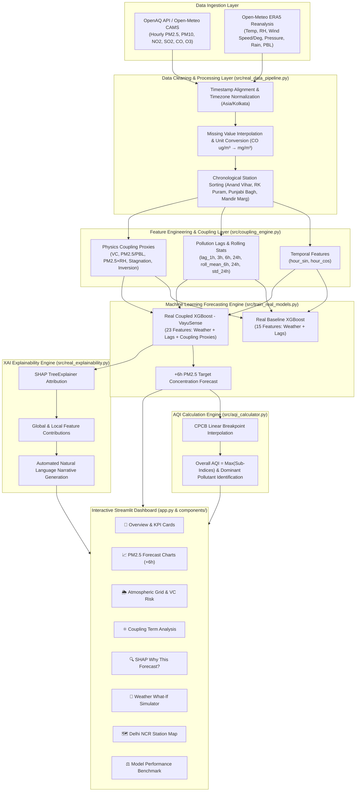

# VayuSense — Air Pollution–Weather Coupled Forecasting System

An explainable hybrid machine learning system for forecasting PM2.5 and AQI by explicitly modeling weather–pollution interactions across Delhi NCR.

---


---

## 1. Project Title

### VayuSense — Air Pollution–Weather Coupled Forecasting System

> *"An explainable hybrid ML system for forecasting PM2.5 and AQI by modeling weather–pollution interactions across Delhi NCR."*

VayuSense bridges atmospheric physics and machine learning to deliver hourly air quality forecasts for Delhi NCR. Unlike traditional black-box or purely statistical time-series models, VayuSense incorporates **physics-informed proxy coupling terms**—such as atmospheric ventilation capacity, boundary layer trapping ratios, thermal inversion flags, and hygroscopic aerosol growth proxies—into XGBoost regressors. Coupled with **SHAP TreeExplainer** attributions and an interactive **Streamlit dashboard**, VayuSense provides explanations for how forecasts evolve with changing weather conditions.

---

## 2. Problem Overview & Scope

| Field | Details |
| :--- | :--- |
| **Project Focus** | Air Pollution–Weather Coupled Forecasting System |
| **Domain** | Clean & Green Technology / Environmental Analytics |
| **Category** | Software / Machine Learning |
| **Target Region** | Delhi National Capital Region (NCR), India |

### The Problem
Delhi NCR experiences some of the most severe air pollution crises globally, particularly during winter months. Air pollutant concentrations (PM2.5, PM10) are governed not only by local and regional emissions but also by local meteorological transport and dispersion mechanisms.

### Limitations of Conventional AQI Forecasting
Conventional statistical and basic machine-learning AQI forecasting models typically treat weather variables (temperature, wind speed, relative humidity) and historical air quality readings as independent, uncoupled features. This independent treatment may underrepresent complex weather–pollution interactions when those relationships are not explicitly represented:
1. **Smog Episode Underprediction**: During calm winter inversion events, stagnant air traps emissions in a shallow mixing layer. Uncoupled models may fail to capture how sudden drops in boundary layer height amplify pollutant density non-linearly.
2. **Ignoring Hygroscopic Growth**: High relative humidity combined with high particulate concentration accelerates secondary aerosol formation and hygroscopic swelling, non-linearly impacting measured PM2.5.
3. **Lack of Physical Interpretability**: Pure statistical models cannot explain whether a forecasted spike is driven by surging emissions or decaying ventilation capacity.

---

## 3. Problem We Are Solving

VayuSense incorporates selected weather–pollution interaction signals using physics-informed proxy features.

```
+-----------------------------------------------------------------------+
|                        METEOROLOGICAL STATE                           |
|  (Temperature, Humidity, Wind Speed/Deg, Surface Pressure, PBL Height) |
+-----------------------------------+-----------------------------------+
                                    |
            WEATHER → POLLUTION     |     POLLUTION → WEATHER
            (Implemented            |     (Physical motivation /
             interaction signals)   |      future modeling scope)
                                    v
+-----------------------------------------------------------------------+
|                      AIR POLLUTION ACCUMULATION                       |
|           (Particulate Density, CPCB Sub-Indices, AQI Risk)           |
+-----------------------------------------------------------------------+
```

### Weather → Pollution (Dispersion & Trapping Mechanisms)
- **Temperature ($T$)**: Surface heating creates buoyant thermal plumes that drive vertical mixing; cold surface temperatures inhibit vertical dispersion.
- **Relative Humidity ($RH$)**: Water vapor absorption by hygroscopic aerosols (sulfates, nitrates) causes particle mass growth under humid conditions.
- **Wind Speed ($u$) & Wind Direction ($\theta$)**: Wind speed controls horizontal advection and flushing rate; wind direction determines transboundary pollutant transport corridors.
- **Surface Pressure ($P$)**: High-pressure synoptic systems induce atmospheric subsidence, sinking air masses, and surface stagnation.
- **Planetary Boundary Layer Height ($h_{PBL}$)**: Defines the vertical mixing volume. Shallow boundary layers ($<400\text{ m}$) compress pollutant volume, dramatically elevating surface PM2.5 concentrations.
- **Thermal Inversion Gradient ($\frac{dT}{dz}$)**: Positive vertical temperature gradients ($\frac{dT}{dz} > 0^\circ\text{C}/100\text{m}$) suppress vertical air movement, locking pollutants near ground level.

### Pollution → Weather (Physical Motivation)
- **Aerosol Radiative Forcing**: Heavy aerosol loading scatters and absorbs incoming solar radiation, reducing surface irradiance, lowering surface temperature, and strengthening lower-tropospheric thermal inversions.
- **Aerosol-PBL Feedback Loop**: Cooler surface temperatures further suppress planetary boundary layer expansion, trapping aerosols in an even shallower volume.

> ℹ️ **Model Implementation vs Physical Motivation Scope Note**:  
> VayuSense does not explicitly solve aerosol radiative forcing, atmospheric chemistry, or two-way meteorological feedback using a numerical atmospheric model such as WRF-Chem. Instead, selected physical relationships are represented through engineered proxy features used by the ML model.

---

## 4. Our Solution

VayuSense provides a dual-pipeline architecture separating **Historical Model Training/Evaluation** from **Near-Real-Time Live Inference**:

```
HISTORICAL PIPELINE (Training & Benchmark Evaluation)
[ 2024 Dataset ] ──> [ Feature Pipeline ] ──> [ Chronological Split ] ──> [ Train XGBoost ] ──> [ Saved Model ]
                                                                                                 │
NEAR-REAL-TIME PIPELINE (Live Stream Inference)                                                 │
[ OpenAQ & Open-Meteo APIs ] ──> [ Recent Window (72h) ] ──> [ Feature Engineering ] ──> [ Live Inference ] ──> [ +6h Forecast ]
                                                                                                                     │
[ Streamlit App ] <── [ CPCB AQI Engine ] <── [ SHAP Explainability Engine ] <───────────────────────────────────────┘
```

1. **Historical Pipeline (Model Training & Evaluation)**:
   - **Data**: Ingests historical 2024 hourly air quality (Open-Meteo CAMS Atmospheric Composition) and weather (Open-Meteo ERA5 Reanalysis).
   - **Training**: Trains XGBoost regressors on strict chronological 70% Train / 15% Val / 15% Test splits.
   - **Saved Artifacts**: Persists trained coupled XGBoost model (`models/real_coupled_xgb.json`) and benchmark metrics (`models/real_model_metrics.json`).

2. **Near-Real-Time Pipeline (Live Inference)**:
   - **Live Ingestion**: Ingests recent observations via `OpenAQProvider` (OpenAQ v3 API with Open-Meteo CAMS fallback) and `OpenMeteoProvider` (Open-Meteo Weather API) for dynamic date ranges up to today.
   - **Feature Construction**: Ingests a 72-hour recent window to compute required historical lags (`1h`, `3h`, `6h`, `24h`), rolling statistics (`6h_mean`, `24h_mean`, `24h_std`), and 8 physics-informed proxy coupling terms.
   - **Live Model Inference**: Passes the latest valid observation row ($T$) into `models/real_coupled_xgb.json` to generate a PM2.5 concentration forecast at target horizon $+6$ hours ($T+6\text{h}$).
   - **AQI Conversion**: Converts current and predicted PM2.5 into CPCB AQI sub-indices and categories.
   - **Live SHAP & Dashboard**: Generates live SHAP feature attributions and renders interactive forecasts, atmospheric grids, and Weather What-If Simulations in Streamlit (`🟢 LIVE / CURRENT DATA`).

> ℹ️ **Live Inference Scope Note**:  
> Current observations are used for live inference with the pre-trained VayuSense model. The model is not automatically retrained on live stream data. If live API endpoints are temporarily unavailable, the dashboard displays a clear warning notice rather than displaying 2024 historical data as current.

---

## 5. Key Innovation — Weather–Pollution Coupling

VayuSense uses an explicit **Coupling Engine** (`src/coupling_engine.py`) that constructs physics-informed proxy interaction terms designed to provide intuitive transport and trapping signals to gradient-boosted decision trees.

### Implemented Coupling Features

| Feature Name | Formula / Logic | Unit | Physical Intuition |
| :--- | :--- | :--- | :--- |
| **Ventilation Capacity** | $VC = u \times h_{PBL}$ | $\text{m}^2/\text{s}$ | A simplified ventilation-capacity indicator combining wind speed and boundary-layer height. Lower VC indicates weaker atmospheric ventilation and greater potential for near-surface pollutant accumulation ($<1500\text{ m}^2/\text{s}$). |
| **Pollutant Trapping Ratio** | $\text{Ratio} = \frac{PM_{2.5}}{h_{PBL} + \epsilon}$ | $\frac{\mu\text{g}/\text{m}^3}{\text{m}}$ | Concentration density per unit vertical mixing height. Higher values signal heavy particulate trapping in a shallow PBL. |
| **Hygroscopic Interaction** | $\text{Proxy} = PM_{2.5} \times RH$ | $\frac{\mu\text{g}}{\text{m}^3} \cdot \%$ | Represents the interaction between particulate concentration and relative humidity and serves as a proxy for humidity-dependent particulate behavior. |
| **Thermal Interaction** | $\text{Proxy} = PM_{2.5} \times T$ | $\frac{\mu\text{g}}{\text{m}^3} \cdot ^\circ\text{C}$ | Represents thermal buoyancy and temperature-dependent aerosol volatility interactions. |
| **Wind Transport Interaction** | $\text{Proxy} = PM_{2.5} \times u$ | $\frac{\mu\text{g}}{\text{m}^3} \cdot \frac{\text{m}}{\text{s}}$ | Proxy for the interaction between pollutant concentration and wind-driven transport and ventilation. |
| **Stagnation Indicator** | $(u < 1.5\text{ m/s}) \land (h_{PBL} < 400\text{ m})$ | $\{0, 1\}$ | Binary flag identifying air stagnation events characterized by calm surface winds and restricted mixing layer height. |
| **Inversion Indicator** | $(\frac{dT}{dz} > 0.0^\circ\text{C}/100\text{m})$ | $\{0, 1\}$ | Binary flag for atmospheric thermal inversion layers that prevent vertical dispersion. |
| **Lagged Trapping Index** | $\text{Index} = \frac{PM_{2.5, t-1h}}{VC + \epsilon}$ | $-$ | Ratio of previous hour's pollutant mass to current dispersion capacity, tracking residual accumulation. |

> ℹ️ **Feature Scope Note**:  
> These engineered interaction features act as physics-informed proxies for tree-based machine learning. They are not equivalent to solving full 3D atmospheric transport or radiative differential equations.

### Physical Intuition Example

$$\text{Ventilation Capacity } (VC) = \text{Wind Speed } (u) \times \text{Boundary Layer Height } (h_{PBL})$$

- When $u = 1.0\text{ m/s}$ and $h_{PBL} = 300\text{ m}$, $VC = 300\text{ m}^2/\text{s}$ ($\rightarrow$ **Severe Trapping**).
- When $u = 5.0\text{ m/s}$ and $h_{PBL} = 1200\text{ m}$, $VC = 6000\text{ m}^2/\text{s}$ ($\rightarrow$ **Good Dispersion**).

VayuSense categorizes dispersion capacity into clear risk regimes:
- **Severe Trapping**: $VC < 800\text{ m}^2/\text{s}$
- **Poor Dispersion**: $800 \le VC < 1500\text{ m}^2/\text{s}$
- **Moderate Dispersion**: $1500 \le VC < 2000\text{ m}^2/\text{s}$
- **Good Dispersion**: $VC \ge 2000\text{ m}^2/\text{s}$

---

## 6. System Architecture

Below is the complete system flow diagram rendered using GitHub Mermaid syntax:



---

## 7. ML Models

VayuSense evaluates two distinct XGBoost regressor models on identical time-series test splits to isolate the performance contribution of explicit coupling features.

### 1. Real Baseline XGBoost Model
- **Purpose**: Represents conventional air quality forecasting without explicit coupling interaction terms.
- **Input Features (15)**: `temperature`, `humidity`, `wind_speed`, `wind_deg`, `pressure`, `pbl_height`, `pm25_lag_1h`, `pm25_lag_3h`, `pm25_lag_6h`, `pm25_lag_24h`, `pm25_roll_mean_6h`, `pm25_roll_mean_24h`, `pm25_roll_std_24h`, `hour_sin`, `hour_cos`.
- **Target**: PM2.5 concentration at $t + 6\text{ hours}$.

### 2. Real Coupled XGBoost Model (VayuSense)
- **Purpose**: Weather–pollution coupled forecasting incorporating physical transport and trapping signals.
- **Input Features (23)**: 15 Baseline features $+$ 8 physics-informed proxy coupling terms (`ventilation_coeff`, `pm25_x_humidity`, `pm25_x_temp`, `pm25_x_wind_speed`, `pm25_div_pbl`, `stagnation_indicator`, `inversion_indicator`, `lagged_pm25_coupling`).
- **Target**: PM2.5 concentration at $t + 6\text{ hours}$.
- **Hyperparameters**:
  - `n_estimators`: 250
  - `max_depth`: 5
  - `learning_rate`: 0.04
  - `subsample`: 0.8
  - `colsample_bytree`: 0.8
  - `random_state`: 42

> 📋 **Model Scope Note**: GRU, LSTM, Attention, and Transformer-based temporal neural networks are **Planned / Future Work** (see Section 25).

---

## 8. Forecast Horizons

| Horizon | Implementation Status | Description |
| :--- | :--- | :--- |
| **+6 Hours** | **Active / Implemented** | Target variable `pm25_target_6h` evaluated across all models and dashboard views. |
| **+1 Hour** | **Planned / Future Work** | Near-term operational forecast horizon. |
| **+3 Hours** | **Planned / Future Work** | Short-term tactical forecast horizon. |
| **+12 Hours** | **Planned / Future Work** | Half-day ahead operational advisory horizon. |
| **+24 Hours** | **Planned / Future Work** | Day-ahead health advisory forecast horizon. |

---

## 9. Data Sources

VayuSense separates observational/reanalysis data from synthetic demo datasets:

| Data Type | Source | Variables Ingested | Mode / Usage |
| :--- | :--- | :--- | :--- |
| **Air Quality (Real)** | OpenAQ API / Open-Meteo CAMS Atmospheric Composition API | PM2.5, PM10, NO2, SO2, CO ($\mu\text{g/m}^3$), O3 | **Real Data Mode** (`DATA_MODE=real`). OpenAQ observations where available, with Open-Meteo CAMS atmospheric-composition/model data as a fallback. |
| **Weather (Real)** | Open-Meteo ERA5 Reanalysis API | Temperature ($^\circ\text{C}$), Relative Humidity (%), Wind Speed ($\text{m/s}$), Wind Direction ($^\circ$), Pressure ($\text{hPa}$), Precipitation ($\text{mm}$), PBL Height ($\text{m}$) | **Real Data Mode** (`DATA_MODE=real`). Open-Meteo ERA5 reanalysis weather data. |
| **Demo Air Quality & Weather** | Synthetic dataset `data/raw/delhi_ncr_aqi_weather_demo.csv` | Synthetic PM2.5, weather, and pollutant observations | **Demo Mode** (`DATA_MODE=demo`). Pre-generated synthetic fallback data for offline testing. |
| *Satellite Aerosol / Fires* | MODIS / VIIRS AOD & FIRMS Fire Data | Aerosol Optical Depth (AOD), Stubble Burning Fire Counts | **Planned / Future Work** (Not implemented). |

---

## 10. Data Processing Pipeline

To maintain data integrity and implement temporal isolation, VayuSense enforces a structured preprocessing pipeline (`src/real_data_pipeline.py` & `src/feature_engineering.py`):

1. **Missing-Value Handling**: Numerical weather fields and pollutant observations undergo linear interpolation (`interpolate(method="linear")`) followed by backward-fill (`bfill()`) and forward-fill (`ffill()`). *This approach is suitable for the current prototype; production deployment may require more conservative handling of long missing periods.*
2. **Timestamp Alignment**: All timestamps are formatted to ISO UTC, converted to local `Asia/Kolkata` timezone, and floored to exact top-of-the-hour boundaries (`YYYY-MM-DD HH:00`).
3. **Spatial Partitioning**: Data is explicitly grouped by monitoring station ID (`Anand_Vihar`, `RK_Puram`, `Punjabi_Bagh`, `Mandir_Marg`) prior to computing shifts or rolling windows.
4. **Time-Series Data Leakage Prevention**:
   - `perform_data_leakage_check()` verifies that target lead variables (e.g., $t+6\text{h}$) are strictly excluded from feature matrix $X$.
   - Feature lags ($t-1\text{h}, t-3\text{h}, t-6\text{h}, t-24\text{h}$) and rolling windows ($6\text{h}, 24\text{h}$) use backward-looking shifts only (`shift(k)` where $k > 0$).
   - Train/Val/Test partitioning uses chronological temporal cuts per station (First 70% Train, Next 15% Val, Final 15% Test) without random shuffling.

---

## 11. Feature Engineering

Features are organized into four functional layers (`src/feature_engineering.py`):

```
       [ Temporal Encodings ]             [ Pollution Lags & Rolling ]
     (hour_sin, hour_cos)               (lag_1h, 3h, 6h, 24h, roll_mean_6h, 24h, std_24h)
               │                                      │
               └──────────────────┬───────────────────┘
                                  │
                                  v
                        [ FEATURE MATRIX X ]
                                  ^
               ┌──────────────────┴───────────────────┐
               │                                      │
       [ Raw Weather Features ]           [ Weather–Pollution Coupling ]
   (Temp, RH, Wind Speed/Deg,           (Ventilation Coeff, PM2.5/PBL, PM2.5×RH,
    Pressure, PBL Height)                Stagnation Flag, Inversion Flag, Lagged VC)
```

### 1. Temporal Features
- `hour_sin`, `hour_cos`: Cyclical sine and cosine encodings of diurnal hour ($0\text{--}23$).

> 💡 **Phase 3.6 Feature Refinement**: Static calendar features (`month`, `is_winter`) were explicitly removed in Phase 3.6 to prevent tree models from memorizing seasonal shortcut heuristics instead of learning dynamic physical interactions.

### 2. Pollution Features (Lags & Rolling Statistics)
- `pm25_lag_1h`, `pm25_lag_3h`, `pm25_lag_6h`, `pm25_lag_24h`: Historical PM2.5 concentrations at $t-1\text{h}, t-3\text{h}, t-6\text{h}, t-24\text{h}$.
- `pm25_roll_mean_6h`, `pm25_roll_mean_24h`: 6-hour and 24-hour moving averages.
- `pm25_roll_std_24h`: 24-hour rolling standard deviation measuring temporal volatility.

### 3. Weather Features
- `temperature` ($^\circ\text{C}$), `humidity` (%), `wind_speed` ($\text{m/s}$), `wind_deg` ($^\circ$), `pressure` ($\text{hPa}$), `pbl_height` ($\text{m}$).

### 4. Physics-Informed Coupling Features
- `ventilation_coeff`, `pm25_x_humidity`, `pm25_x_temp`, `pm25_x_wind_speed`, `pm25_div_pbl`, `stagnation_indicator`, `inversion_indicator`, `lagged_pm25_coupling` (see formulas in Section 5).

---

## 12. Explainability

VayuSense provides feature attribution explanations using **SHAP (SHapley Additive exPlanations) TreeExplainer** (`src/real_explainability.py`).

### Evaluated Sample Local Attribution & Automated Narrative
For individual forecasts, SHAP estimates the positive or negative contribution of each input feature to the model output relative to the expected model output ($\mathbb{E}[f(x)]$).

```text
Evaluated Sample Output (from models/real_shap_demo_explanation.json):
Baseline Expected Model Output : 89.8 µg/m³
+ Time of Day (Sin)             : +13.96 µg/m³
+ Temperature-PM2.5 Interaction : +8.28 µg/m³  (PM2.5 × Temp proxy)
+ Temperature (°C)             : +4.00 µg/m³
+ PM2.5 (6h ago)                : +3.71 µg/m³
+ Ventilation Capacity          : +2.73 µg/m³
- Lagged Trapping Index        : -6.49 µg/m³
- Humidity-PM2.5 Interaction    : -1.78 µg/m³
- Wind Direction (°)            : -1.64 µg/m³
-------------------------------------------------------------------------
Final Predicted PM2.5 (+6h)     : 121.4 µg/m³  (CPCB AQI 302 — Very Poor)
```

### Factor Classification

#### Factors Increasing Predicted Pollution (+)
- **Low Ventilation Capacity** ($VC < 1500\text{ m}^2/\text{s}$)
- **Shallow Boundary Layer** ($h_{PBL} < 400\text{ m}$)
- **High Relative Humidity Interaction** ($PM_{2.5} \times RH$)
- **Active Air Stagnation Flag** ($u < 1.5\text{ m/s} \land h_{PBL} < 400\text{ m}$)
- **Active Thermal Inversion Flag** ($\frac{dT}{dz} > 0$)
- **Elevated Antecedent PM2.5 Lags** (`pm25_roll_mean_24h`)

#### Factors Suppressing Predicted Pollution (-)
- **Strong Horizontal Wind Speed** ($u \ge 3.5\text{ m/s}$)
- **Deep Boundary Layer Height** ($h_{PBL} \ge 1000\text{ m}$)
- **High Ventilation Capacity** ($VC \ge 2000\text{ m}^2/\text{s}$)
- **Low Antecedent Particulate Load**

---

## 13. AQI Calculation

VayuSense implements the official **Central Pollution Control Board (CPCB) Indian National Air Quality Index** linear breakpoint interpolation methodology (`src/aqi_calculator.py`).

### CPCB Sub-Index Formula

$$I_p = I_{\text{low}} + \left[ \frac{I_{\text{high}} - I_{\text{low}}}{C_{\text{high}} - C_{\text{low}}} \right] \times (C_p - C_{\text{low}})$$

Where:
- $C_p$: Observed concentration of pollutant $p$
- $C_{\text{low}}, C_{\text{high}}$: Breakpoint concentration range containing $C_p$
- $I_{\text{low}}, I_{\text{high}}$: Sub-index range corresponding to $[C_{\text{low}}, C_{\text{high}}]$

### CPCB Breakpoint Scale (PM2.5 & PM10 Focus)

| AQI Category | Sub-Index Range ($I$) | PM2.5 ($\mu\text{g/m}^3$) | PM10 ($\mu\text{g/m}^3$) | Hex Color | Severity Rank |
| :--- | :---: | :---: | :---: | :---: | :---: |
| **Good** | $0 \text{--} 50$ | $0 \text{--} 30$ | $0 \text{--} 50$ | `#00e400` | 1 |
| **Satisfactory** | $51 \text{--} 100$ | $30.1 \text{--} 60$ | $50.1 \text{--} 100$ | `#7bb31a` | 2 |
| **Moderate** | $101 \text{--} 200$ | $60.1 \text{--} 90$ | $100.1 \text{--} 250$ | `#ff7e00` | 3 |
| **Poor** | $201 \text{--} 300$ | $90.1 \text{--} 120$ | $250.1 \text{--} 350$ | `#ff0000` | 4 |
| **Very Poor** | $301 \text{--} 400$ | $120.1 \text{--} 250$ | $350.1 \text{--} 430$ | `#99004c` | 5 |
| **Severe** | $401 \text{--} 500+$ | $> 250$ | $> 430$ | `#7e0023` | 6 |

> ℹ️ **Forecast Scope Note**:  
> In the current implementation, the ML model forecasts future PM2.5 concentration at $t+6\text{h}$. Future AQI is derived directly from the predicted PM2.5 sub-index. Multi-pollutant overall AQI ($\max(I_{PM2.5}, I_{PM10}, I_{NO2}, \dots)$) is calculated for current real-time observations when all pollutant readings are available.

---

## 14. Dashboard

The user interface is built as a multi-page **Streamlit** web application (`app.py` & `components/`):

```
+-----------------------------------------------------------------------+
|  🌿 VayuSense — AI-Powered Weather–Pollution Coupled System           |
+-----------------------------------------------------------------------+
|  NAVIGATION MENU          |  MAIN CONTENT VIEW AREA                   |
|  - 📌 Overview            |                                           |
|  - 📈 PM2.5 Forecast      |  [ AQI Badge Card ]   [ KPI Grid Cards ]  |
|  - 🌦️ Atmospheric Grid   |                                           |
|  - ⚛️ Coupling Analysis   |  [ Interactive Plotly Forecast Chart ]   |
|  - 🔍 SHAP Explainability |                                           |
|  - 🧪 What-If Simulator   |  [ Dispersion Risk & Weather Grid ]       |
|  - 🗺️ Station Map        |                                           |
|  - ⚖️ Model Benchmarks    |  [ SHAP Waterfall & Narrative Output ]    |
|  - ℹ️ About VayuSense     |                                           |
+-----------------------------------------------------------------------+
```

### Included Dashboard Modules
1. 📌 **Overview**: CPCB AQI badge card, KPI cards (Current PM2.5, +6h Forecast PM2.5, Expected AQI, Risk Level), ventilation capacity card, and meteorological grid.
2. 📈 **PM2.5 Forecast**: Interactive Plotly time-series chart comparing Actual vs Real Baseline XGBoost vs Real Coupled XGBoost (+6h target horizon).
3. 🌦️ **Atmospheric Conditions**: Detailed grid displaying temperature, humidity, wind speed/direction, surface pressure, boundary layer height, and dispersion classification.
4. ⚛️ **Weather-Pollution Coupling**: Visual bar chart of calculated physics interaction proxy values and physical transport flow diagram.
5. 🔍 **Why This Forecast? (SHAP)**: Automated narrative explanation, local waterfall bar breakdown of positive/negative SHAP contributors, physics proxy attribution share (%), and global SHAP summary images.
6. 🧪 **Weather What-If Simulator**: Interactive sliders for wind speed ($0.1\text{--}15\text{ m/s}$), PBL height ($10\text{--}2000\text{ m}$), relative humidity ($15\text{--}100\%$), and temperature ($0\text{--}48^\circ\text{C}$) executing real-time feature re-coupling and XGBoost inference.
7. 🗺️ **Delhi NCR Station Map**: Interactive Plotly scatter map rendering color-coded AQI markers for monitoring stations (Anand Vihar, RK Puram, Punjabi Bagh, Mandir Marg).
8. ⚖️ **Model Performance**: Quantitative benchmark comparison tables and evaluation charts.
9. ℹ️ **About VayuSense**: Documentation of system architecture, data provenance, and disclaimers.

---

## 15. Technology Stack

| Layer | Technology | Usage / Purpose |
| :--- | :--- | :--- |
| **Language** | Python 3.10+ | Core development environment |
| **Machine Learning** | XGBoost (`xgboost>=1.7.0`), Scikit-Learn (`scikit-learn>=1.2.0`) | Gradient boosted decision trees for time-series forecasting |
| **Explainable AI (XAI)**| SHAP (`shap>=0.42.0`) | TreeExplainer model attribution and feature contribution waterfall analysis |
| **Data Ingestion & APIs**| Requests, Python-Dotenv, OpenAQ API, Open-Meteo API | Air quality and ERA5 weather reanalysis ingestion |
| **Data Processing** | Pandas (`pandas>=2.0.0`), NumPy (`numpy>=1.24.0`), Joblib | Time-series manipulation, linear interpolation, lag/rolling feature engineering |
| **Visualization** | Plotly (`plotly>=5.14.0`), Matplotlib (`matplotlib>=3.7.0`) | Interactive time-series charts, station maps, and static SHAP figures |
| **Frontend / Web App** | Streamlit (`streamlit>=1.25.0`) | Interactive web application dashboard framework |
| **Testing** | Pytest (`pytest`), Unittest | Automated unit and integration test suite |

---

## 16. Project Structure

```text
VayuSense/
├── app.py                      # Main Streamlit dashboard entry point
├── requirements.txt            # Python dependencies manifest
├── .env.example                # Environment variable template
├── app/                        # Additional Streamlit app configs
│   ├── app.py                  # Streamlit entry copy
│   └── components/             # App sub-components
├── components/                 # UI dashboard component modules
│   ├── charts.py               # Plotly forecast & coupling chart renderers
│   ├── header.py               # Header banner & data provenance notice
│   ├── kpi_cards.py            # AQI badge, KPI metrics & weather grid renderers
│   ├── map_view.py             # Plotly Delhi NCR station map component
│   ├── model_perf.py           # Model benchmark evaluation view
│   ├── shap_view.py            # SHAP explainability dashboard view
│   └── simulator.py            # Interactive Weather What-If Simulator
├── data/                       # Data directory
│   ├── raw/                    # Raw historical CSVs (real_delhi_ncr_data.csv, delhi_ncr_aqi_weather_demo.csv)
│   └── processed/              # Processed feature matrices & prediction output CSVs
├── models/                     # Model artifacts (.json), evaluation plots (.png) & metrics (.json)
│   ├── real_baseline_xgb.json  # Trained Real Baseline XGBoost model
│   ├── real_coupled_xgb.json   # Trained Real Coupled XGBoost model
│   ├── real_model_metrics.json # Benchmark metrics on real test dataset
│   └── real_shap_*.png         # SHAP feature importance & summary plots
├── src/                        # Core Python source code
│   ├── aqi_calculator.py       # CPCB Indian AQI linear interpolation engine
│   ├── audit_real_data.py      # Real dataset quality & data leakage audit suite
│   ├── coupling_engine.py      # Physics-informed weather-pollution proxy coupling engine
│   ├── data_generator.py       # Demo synthetic data generator
│   ├── evaluate.py             # Model evaluation metric helper functions
│   ├── explainability.py       # SHAP TreeExplainer engine (Demo mode)
│   ├── feature_engineering.py  # Lag, rolling & cyclical feature engineering pipeline
│   ├── model_predictor.py      # Prediction inference helper
│   ├── model_trainer.py        # Baseline vs Coupled trainer (Demo mode)
│   ├── pre_training_validation.py # Data leakage & temporal integrity validator
│   ├── preprocessing.py        # Dataset loading & preprocessing utilities
│   ├── real_data_pipeline.py   # Real data ingestion, merging & alignment pipeline
│   ├── real_explainability.py  # SHAP TreeExplainer engine (Real mode)
│   ├── train_final_models.py   # Final model training execution
│   ├── train_real_models.py    # Real data model training & evaluation engine
│   └── data_providers/         # External API data provider modules
│       ├── openaq_provider.py  # OpenAQ v3 / Open-Meteo CAMS air quality provider
│       └── openmeteo_provider.py # Open-Meteo ERA5 weather provider
└── tests/                      # Automated unit and integration test suite
    ├── test_app_integration.py # Dashboard integration test
    ├── test_coupling.py        # Coupling feature math unit tests
    ├── test_explainability.py  # SHAP explainer unit tests
    ├── test_model_pipeline.py  # Model training pipeline tests
    ├── test_phase1.py          # Data ingestion & schema tests
    ├── test_real_data_pipeline.py # Real data ingestion pipeline tests
    └── test_real_model_pipeline.py # Real model training pipeline tests
```

---

## 17. Installation

### Prerequisites
- **Python**: Version `3.10` or higher
- **Git**: Installed on system

### 1. Clone Repository
```bash
git clone YOUR_GITHUB_REPOSITORY_URL
cd VayuSense
```

### 2. Set Up Virtual Environment

**On Windows:**
```powershell
python -m venv venv
.\venv\Scripts\activate
```

**On Linux / macOS:**
```bash
python3 -m venv venv
source venv/bin/activate
```

### 3. Install Dependencies
```bash
pip install --upgrade pip
pip install -r requirements.txt
```

### 4. Configure Environment Variables (`.env`)
Create your own `.env` file from `.env.example`:

```bash
cp .env.example .env
```

Edit `.env` as needed:

```env
# Mode selection: 'real' (Open-Meteo CAMS/ERA5 stream) or 'demo' (offline synthetic data)
DATA_MODE=real

# Optional OpenAQ v3 API key (if unset, system automatically uses Open-Meteo CAMS stream)
OPENAQ_API_KEY=your_openaq_api_key
```

---

## 18. Running the Project

VayuSense provides explicit entry scripts for workflow steps:

### 1. Start Dashboard Application
Launch the interactive Streamlit dashboard:
```bash
streamlit run app.py
```
*Access in browser at `http://localhost:8501`*

### 2. Run Real Data Pipeline (Ingestion & Preprocessing)
Fetch historical observations, apply hourly alignment, and compute coupling features:
```bash
python src/real_data_pipeline.py
```

### 3. Run Data Integrity Audit
Execute the dataset quality audit suite:
```bash
python src/audit_real_data.py
```

### 4. Train Models on Real Data
Train Real Baseline XGBoost vs Real Coupled XGBoost on real data:
```bash
python src/train_real_models.py
```

### 5. Run SHAP Explainability Engine
Compute global and local SHAP feature attributions and generate plots:
```bash
python src/real_explainability.py
```

### 6. Run Test Suite
Execute unit and integration tests:
```bash
python -m unittest discover -s tests
```

---

## 19. API Documentation

VayuSense operates as a modular Python package with a Streamlit interface.

### Core Python Module Interfaces

#### 1. CPCB AQI Engine (`src/aqi_calculator.py`)
```python
from src.aqi_calculator import calculate_overall_aqi, calculate_sub_index

# Calculate sub-index for single pollutant
pm25_sub_index = calculate_sub_index(124.5, pollutant="pm25")  # Output: 304.5

# Calculate overall AQI across all pollutants
row_data = {"pm25": 124.5, "pm10": 210.0, "no2": 45.0}
aqi_result = calculate_overall_aqi(row_data)
# Returns dict: {'overall_aqi': 304.5, 'dominant_pollutant': 'PM25', 'category': 'Very Poor', ...}
```

#### 2. Coupling Engine (`src/coupling_engine.py`)
```python
from src.coupling_engine import compute_coupling_features

# Computes 8 physics proxy coupling terms on input DataFrame
df_coupled = compute_coupling_features(df_raw)
```

#### 3. SHAP Explainer (`src/real_explainability.py`)
```python
from src.real_explainability import VayuSenseRealSHAPExplainer

explainer = VayuSenseRealSHAPExplainer()
local_explanation = explainer.explain_prediction(df_single_row)
# Returns dict: {'predicted_pm25': ..., 'positive_contributors': [...], 'narrative': "..."}
```

> 📋 **REST API Scope Note**: Production REST API endpoints (FastAPI / Flask with `/stations`, `/forecast/{station_id}`, `/predict`) are **Planned / Future Work** (see Section 25).

---

## 20. Model Evaluation

Models were trained and evaluated on an out-of-sample test split (`2024-03-19` to `2024-04-01`, 1,312 hourly observations across 4 Delhi NCR stations).

### Benchmark Comparison (Target: PM2.5 at +6 Hours Horizon)

| Evaluation Metric | Real Baseline XGBoost | Real Coupled XGBoost (VayuSense) | Quantitative Metric Comparison |
| :--- | :---: | :---: | :---: |
| **Overall MAE** ($\mu\text{g/m}^3$) | 15.60 | **14.59** | **6.49% MAE Reduction** |
| **Overall RMSE** ($\mu\text{g/m}^3$) | 19.48 | **17.98** | **7.70% RMSE Reduction** |
| **$R^2$ Score** | -0.4776 | **-0.2588** | **+0.2188 Absolute $R^2$ Gain** |
| **Low Ventilation MAE** ($VC < 1500\text{ m}^2/\text{s}$) | 15.60 | **14.59** | **6.49% MAE Reduction** |
| **Thermal Inversion MAE** ($\frac{dT}{dz} > 0$) | 10.93 | **10.95** | -0.11% Change |
| **Air Stagnation MAE** ($u < 1.5\text{ m/s} \land h_{PBL} < 400\text{ m}$) | 16.83 | **15.35** | **8.81% MAE Reduction** |

*Note: The coupled model reduced overall MAE and RMSE and improved performance during air-stagnation conditions, while thermal-inversion MAE was nearly unchanged and slightly higher than the baseline (10.95 vs 10.93 $\mu g/m^3$). Both models have negative R² on this test split, indicating that their predictions do not outperform a mean-value predictor under the R² criterion. The coupled model nevertheless improves MAE and RMSE relative to the baseline and achieves an absolute R² gain of +0.2188 (-0.2588 vs -0.4776).*

*Severe smog episodes ($PM_{2.5} \ge 250\ \mu g/m^3$) were not present in the spring 2024 test window (`2024-03-19` to `2024-04-01`), so high-pollution episode metrics for that specific test set could not be evaluated.*

---

## 21. Demo Mode

To allow local offline demonstration without requiring live network connections or external API keys, VayuSense supports **Demo Mode**:

- **Activation**: Edit `.env` and set `DATA_MODE=demo`.
- **Dataset**: Ingests pre-generated synthetic multi-station data from `data/raw/delhi_ncr_aqi_weather_demo.csv`.
- **Pre-trained Models**: Loads `models/final_coupled_xgb.json` for offline Streamlit interactive testing.
- **Notice Banner**: The dashboard automatically displays a `⚠️ DEMO MODE — SYNTHETIC DATA` status banner when active.

---

## 22. Example Workflow

```
Delhi NCR Station Coordinates (Anand Vihar, RK Puram, Punjabi Bagh, Mandir Marg)
                                    │
                                    v
Data Ingestion (OpenAQ API / Open-Meteo CAMS Air Quality & ERA5 Weather)
                                    │
                                    v
Data Cleaning & Hourly Alignment (`src/real_data_pipeline.py`)
                                    │
                                    v
Historical Lag & Rolling Feature Construction (`src/feature_engineering.py`)
                                    │
                                    v
Physics-Informed Proxy Feature Injection (`src/coupling_engine.py` → VC, Trapping, RH)
                                    │
                                    v
Real Coupled XGBoost Model Inference (`src/train_real_models.py`)
                                    │
                                    v
Predicted PM2.5 (+6h) & CPCB Indian AQI Calculation (`src/aqi_calculator.py`)
                                    │
                                    v
SHAP TreeExplainer Local Attribution & Narrative (`src/real_explainability.py`)
                                    │
                                    v
Interactive Dashboard Render & What-If Simulator (`app.py`)
```

---

## 23. Why This Approach Matters

1. **Captures Physical Transport Indicators**: Incorporating Ventilation Capacity ($VC$) and Pollutant Trapping Ratios allows decision trees to evaluate boundary layer dynamics that raw weather features miss.
2. **Reduces Reliance on Seasonal Shortcut Features**: Removing static calendar variables such as `month` and `is_winter` encourages the model to rely more on dynamic meteorological and pollution interactions rather than directly using seasonal calendar indicators.
3. **Actionable Explainability**: SHAP TreeExplainer attributions and automated natural language text allow environmental reviewers to inspect feature contributions behind a forecast.
4. **Time-Series Data Leakage Prevention**: Automated checks (`perform_data_leakage_check`) enforce strict chronological splits per station for test set evaluation.
5. **Interactive Weather What-If Simulation**: Users can modify weather-related variables such as wind speed, PBL height, humidity, and temperature and observe the resulting model prediction.

---

## 24. Limitations

System boundaries and scope limitations:

- **Data Provenance**: Real Air Quality data utilizes OpenAQ observations where available, with Open-Meteo CAMS atmospheric-composition/model data as a fallback when direct ground sensor streams are unavailable.
- **PBL Height Resolution**: Boundary layer height in winter atmospheric reanalysis data exhibits surface inversion quantization (median $40\text{ m}$).
- **Historical Data Window**: The real training dataset spans ~3 months of historical data (Jan 01, 2024 to Apr 01, 2024; 8,832 total observations across 4 stations).
- **Physical Proxy Simplification**: Coupling terms are physics-informed proxy interaction features designed for tree-based ML models, not a full two-way numerical atmospheric simulation (such as WRF-Chem).
- **Forecast Horizon**: The system is currently configured for a $+6$-hour target forecast horizon.

---

## 25. Future Improvements

Planned future developments:

- [ ] **Direct CPCB / IMD API Integration**: Streaming feeds from ground monitoring stations across Delhi NCR.
- [ ] **Deep Learning Temporal Architectures**: Implementation of GRU, LSTM, and Temporal Fusion Transformer (TFT) models.
- [ ] **Multi-Horizon Models**: Simultaneous forecasting across $+1\text{h}, +3\text{h}, +12\text{h}, +24\text{h}, \text{and } +48\text{h}$ lead times.
- [ ] **REST API Server**: FastAPI deployment providing OpenAPI/Swagger endpoints (`/stations`, `/forecast/{station_id}`, `/predict`).
- [ ] **Satellite Aerosol & Fire Integration**: Real-time satellite Aerosol Optical Depth (AOD) and FIRMS stubble burning fire count feeds.
- [ ] **Spatial Graph Neural Networks (GNNs)**: Modeling spatial advection and cross-station pollutant transport across Delhi NCR.
- [ ] **Automated CI/CD Retraining**: Continuous model retraining and drift monitoring pipelines.

---

## 26. Feature & Requirement Matrix

| Core Requirement | VayuSense Implementation |
| :--- | :--- |
| **Pollution Forecasting** | Implemented $+6\text{h}$ PM2.5 forecasting engine with official CPCB Indian AQI sub-index calculation. |
| **Weather Integration** | Ingests temperature, relative humidity, wind speed, wind direction, surface pressure, precipitation, and PBL height via Open-Meteo ERA5. |
| **Weather–Pollution Coupling** | Engineered 8 explicit physics-informed coupling proxies (Ventilation Capacity, Trapping Ratio, PM2.5×RH, Stagnation/Inversion flags). |
| **Explainability** | SHAP TreeExplainer engine generating feature attribution share (%), local waterfall breakdowns, and automated natural language narratives. |
| **Delhi NCR Focus** | Station-specific data processing and forecasting for Anand Vihar, RK Puram, Punjabi Bagh, and Mandir Marg. |
| **Forecast Visualization** | Interactive Streamlit dashboard featuring Plotly time-series forecast charts, weather grids, and Delhi NCR station map. |
| **Model Comparison** | Evaluation benchmarking Real Baseline XGBoost against Real Coupled XGBoost on identical test splits. |

---

## 27. Team / Contributors

Add project contributors here.

---

## 28. License

License information will be added.
